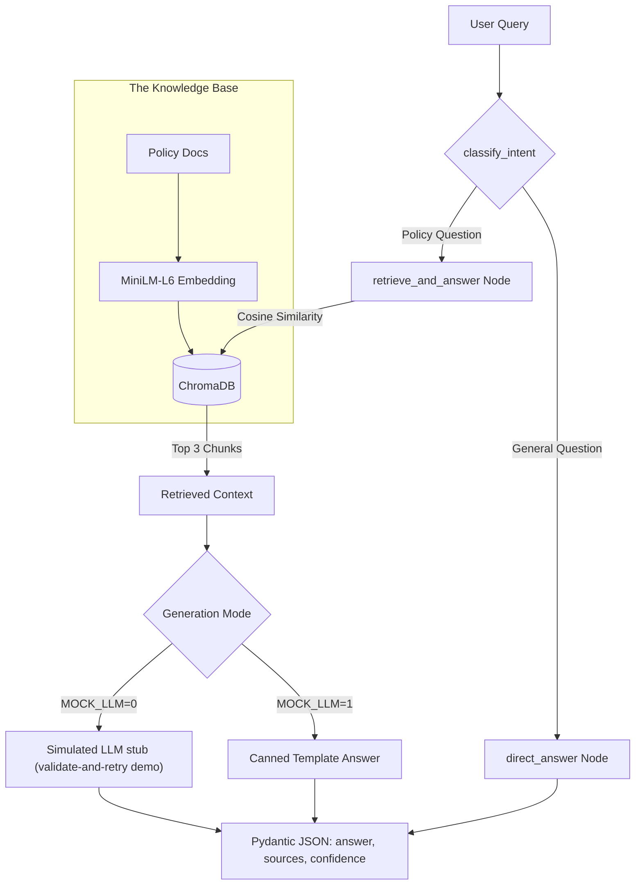

# Zepto Support Assistant - Module 3

## Overview
The Support Assistant is a complete GenAI service designed to answer policy-related questions grounded in Zepto's official documentation. It implements a RAG (Retrieval-Augmented Generation) pipeline orchestrated by LangGraph and served via FastAPI.



## Architecture Description

### Pipeline Stages:
1. **Ingestion**: Eight policy documents (`doc_01.txt` to `doc_08.txt`) are loaded into the system via the `populate_db()` function.
2. **Embedding**: Each document is embedded using the `all-MiniLM-L6-v2` model (via the `minilm_ef` embedding function) from the `sentence-transformers` library, ensuring efficient semantic representation. Chunking is handled as one chunk per document.
3. **Indexing**: Embeddings are stored in a **ChromaDB** collection named `company_docs` for high-performance cosine similarity search.
4. **Routing (LangGraph)**:
   - The `classify_intent` node determines if a query is a `policy_question` (requires retrieval) or a `general_question` (direct answer).
   - A conditional edge routes the flow to either `retrieve_and_answer` or `direct_answer`.
5. **Retrieval**: For policy questions, the `retrieve_and_answer` node retrieves the top 3 most relevant chunks from ChromaDB.
6. **Generation**:
   - **Mock Mode (Default, MOCK_LLM=1)**: Returns a deterministic, canned response: `"Based on the retrieved context: {snippet}"`.
   - **Real LLM Mode (Optional, MOCK_LLM=0)**: Runs a simulated LLM stub (validate-and-retry demo) using a structured role-context-task-format-length template defined in `PROMPT_TEMPLATE`.

### Data Flow:
`User Query` $\rightarrow$ `classify_intent` $\rightarrow$ (`retrieve_and_answer` $\rightarrow$ `ChromaDB`) OR (`direct_answer`) $\rightarrow$ `Pydantic Response Model` $\rightarrow$ `FastAPI /ask endpoint`.

### MOCK_LLM Toggle:
- **Default (1)**: Fully offline and deterministic. Intent classification (`classify_intent`) and direct answers (`direct_answer`) are always keyword or static-based. Answers for policy questions are templated. No network calls are made.
- **Extension (0)**: Runs a simulated stub in the `retrieve_and_answer` node that demonstrates the validate-and-retry loop; no external LLM is called. Note: Intent classification remains keyword-based in this implementation.

## Implementation Details
- **Structured Output**: Enforces a JSON schema via Pydantic with fields for `answer`, `sources` (list of doc IDs), and `confidence` (float).
- **API Wrapper**: A FastAPI application provides a `POST /ask` endpoint.
- **Containerization**: Includes a `Dockerfile` that builds a locally runnable image serving the assistant on port 7860.

## Example API Calls (Mock Mode)

### 1. Policy Question
**Request:**
```json
{
  "query": "What is the delivery fee for orders below 149?"
}
```
**Response:**
```json
{
  "answer": "Based on the retrieved context: doc_01 — Delivery Policy: \"Zepto delivers grocery and household essentials to serviceable pin codes within 10 to 30 minutes of order confirmation, depending on the customer's delivery zone and current...",
  "sources": ["doc_01", "doc_05", "doc_02"],
  "confidence": 1.0
}
```

### 2. General Question
**Request:**
```json
{
  "query": "What is the weather today?"
}
```
**Response:**
```json
{
  "answer": "I can only answer questions about Zepto policies right now.",
  "sources": [],
  "confidence": 1.0
}
```

### 3. Returns Query
**Request:**
```json
{
  "query": "How do I return an item?"
}
```
**Response:**
```json
{
  "answer": "Based on the retrieved context: doc_02 — Returns & Refunds: \"Grocery and perishable items may be reported for a return within 24 hours of delivery if damaged, spoiled, or incorrect; non-perishable packaged items may be returned with...",
  "sources": ["doc_02", "doc_05", "doc_06"],
  "confidence": 1.0
}
```

### 4. Gift Card Query
**Request:**
```json
{
  "query": "Can I use a gift card?"
}
```
**Response:**
```json
{
  "answer": "Based on the retrieved context: doc_07 — Gift Cards: \"Zepto gift cards are available in fixed denominations of INR 100, INR 250, INR 500, and INR 1000, and are delivered by email or SMS within minutes of purchase. Gift cards are val...",
  "sources": ["doc_07", "doc_01", "doc_02"],
  "confidence": 1.0
}
```

### 5. Support Hours Query
**Request:**
```json
{
  "query": "What are the support hours?"
}
```
**Response:**
```json
{
  "answer": "Based on the retrieved context: doc_08 — Customer Support Hours: \"Zepto customer support is available via in-app chat 24 hours a day, 7 days a week, given the time-sensitive nature of quick commerce deliveries. Average in-app chat r...",
  "sources": ["doc_08", "doc_03", "doc_04"],
  "confidence": 1.0
}
```

## Local Setup & Deployment

### Run Locally
1. Install dependencies: `pip install -r requirements.txt`
2. Start the server: `python main.py`
3. The API will be available at `http://localhost:7860/ask`.

### Run via Docker
1. Build the image: `docker build -t zepto-assistant .`
2. Run the container: `docker run -p 7860:7860 zepto-assistant`

### Project Structure
The assistant is located in the `/support_assistant` directory. The requirements are specified in `support_assistant/requirements.txt` and the policy documents are located in `support_assistant/docs/`.
